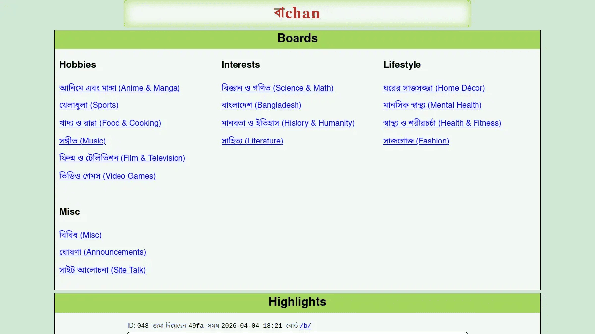

#+TITLE: বাchan: A Bengali Internet Forum

An internet forum for Bengali speaking community that respects
anonymity and the freedom of speech.

#+CAPTION: Homepage of Bachan on April 5, 2026

The source code for বাchan is licensed under GNU Affero General Public
License. See [[file:COPYING][COPYING]] for more information.

* Core Philosophy

বাchan lets Bengali netizens post without revealing their identity.
The site features different boards for various interests. Users can
post new threads, reply to an existing thread, use text hotlink images
in their post, format texts, reference other posts, and quote other
users without having to register an account. Each thread or reply has
a unique ID and a hashed user ID indicating the person who posted it.
The user ID is unique per thread to preserve users' anonymity across
threads.

* Visit বাchan

[[https://bachan-production.up.railway.app/]]

Be sure to read the rules before participating on the site.
